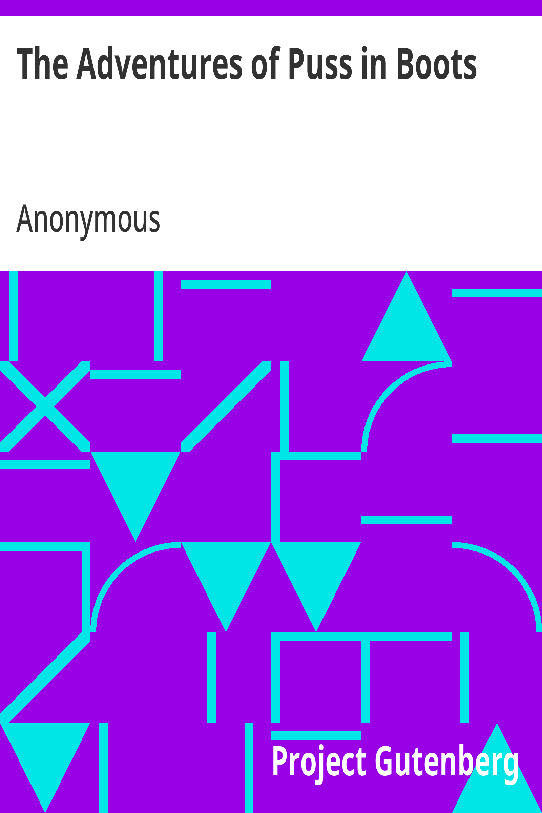

## The Project Gutenberg eBook of The Adventures of Puss in Boots

This eBook is for the use of anyone anywhere in the United States and most other parts of the world at no cost and with almost no restrictions whatsoever. You may copy it, give it away or re-use it under the terms of the Project Gutenberg License included with this eBook or online at [www.gutenberg.org](https://www.gutenberg.org){.reference .external}. If you are not located in the United States, you will have to check the laws of the country where you are located before using this eBook.

**Title**: The Adventures of Puss in Boots

**Author**: Anonymous

\

**Release date**: September 25, 2011 \[eBook #37529\]

**Language**: English

**Other information and formats**: [www.gutenberg.org/ebooks/37529](https://www.gutenberg.org/ebooks/37529)

**Credits**: Produced by Larry B. Harrison, and the Archives and Special\
Collections, University Libraries, Ball State University\
and the Online Distributed Proofreading Team at\
http://www.pgdp.net

\*\*\* START OF THE PROJECT GUTENBERG EBOOK THE ADVENTURES OF PUSS IN BOOTS \*\*\*

------------------------------------------------------------------------

 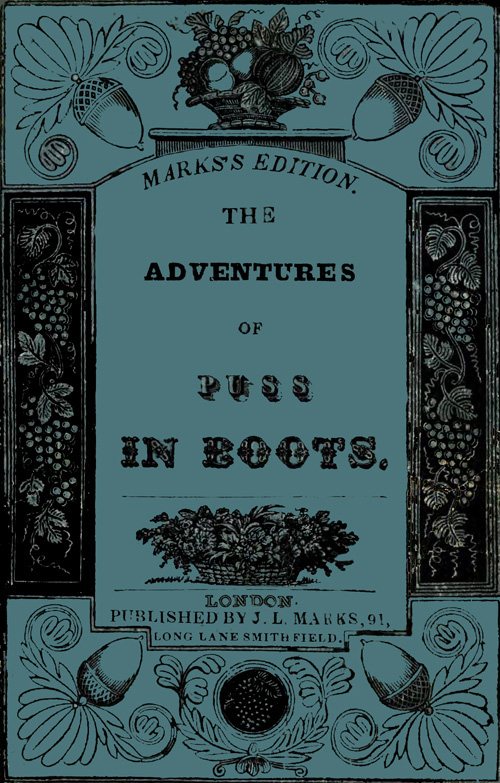

------------------------------------------------------------------------

### *MARKS\'S EDITION.*

### THE

### ADVENTURES

#### OF

## PUSS

# IN BOOTS.

#### LONDON.

#### PUBLISHED BY J. L. MARKS, 91,

##### LONG LANE SMITHFIELD.

------------------------------------------------------------------------

 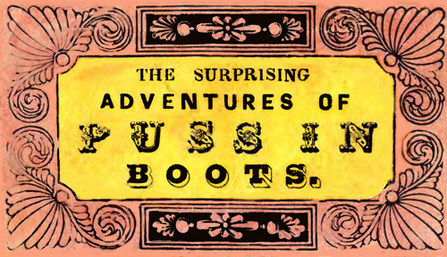

## THE SURPRISING ADVENTURES OF PUSS IN BOOTS.

 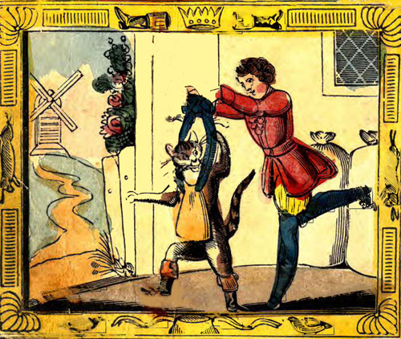

There once liv\'d a young man who was very poor.\
 For all that he had was a Cat;\
 His food being gone, he could get no more,\
 And so he resolv\'d to kill that.\

Now Puss from the cupboard came out and thus spoke,\
 \"Grieve not my good master, I pray,\
 Provide me with boots, and a bag---\'tis no joke---\
 Your fortune I\'ll make then straightway.\"\

 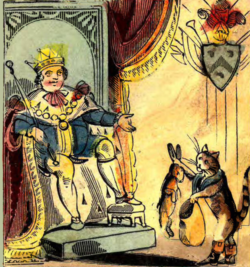

Puss baited his bag with parsley and bread,\
 And away to a warren he hied,\
 Where he laid himself down as if he was dead,\
 Until some young rabbits he spied.\

One entered the bag, puss pull\'d at the string,\
 The rabbit was kill\'d in a trice,\
 Puss said this fine game I\'ll take to the king,\
 I\'m sure he will say it is nice.\

 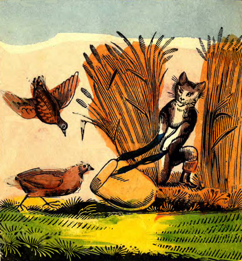

Next day to a wheat-field Grimalkin repair\'d,\
 And there two fine partridges caught,\
 These he took to the king who kindly enquired,\
 From whence the fine present was brought.\

\"From the Marquis Carabas, great Monarch,\" said he,\
 \"These birds and the rabbit I bring,\"\
 They both were accepted, and puss in high glee\
 Receiv\'d a reward from the king.\

 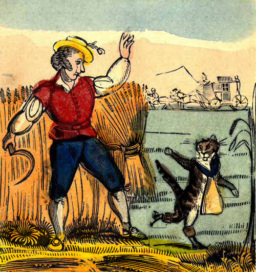

This king took a journey, his kingdom to view,\
 With his daughter so fine and so gay,\
 What happen\'d then, I will now tell unto you,\
 To my tale therefore listen I pray.\

Puss ran to a cornfield, to the reapers he said,\
 \"When the king comes these words you repeat,\
 \'To the Marquis Carabas these fields all belong,\
 Or I\'ll chop you as small as minced meat.\'\"\

 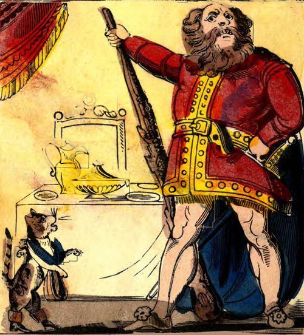

To an Ogre\'s grand castle grimalkin now went,\
 Which was opened by servants so gay,\
 \'Is his highness the Ogre at home sir,\' said he,\
 \'For my bus\'ness is urgent to-day.\'\

The Ogre received him with kindness, and now,\
 Puss entr\'d the castle so gay,\
 When making a low and reverend bow,\
 He march\'d to the parlour straightway.\

 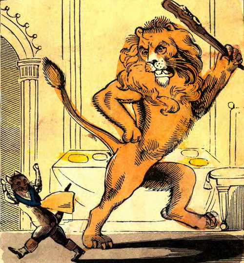

\'Tis thought mighty Ogre by all in the nation,\
 That miraculous power you possess,\
 The power, when you please, of complete transformation,\
 This a miracle is and no less.\

To convince you \'tis true, the Ogre replied,\
 I will change myself now in your sight:\
 He did so---a lion he now roars by his side,\
 Which put the poor cat in a fright.\

 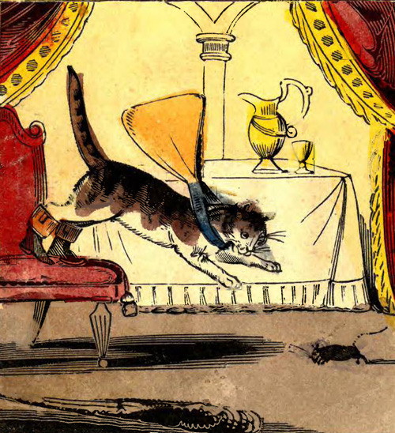

\"Mighty sir,\" said the Cat, \"such a change I must say,\
 I never expected to view:\
 Yet I venture to doubt---your pardon I pray,\
 If a mouse you could change yourself to.\"\

Doubt not, said the Ogre, my power to do so,\
 When a mouse he directly became,\
 On his victim Grimalkin immediately flew,\
 And sealed in an instant his doom.\

 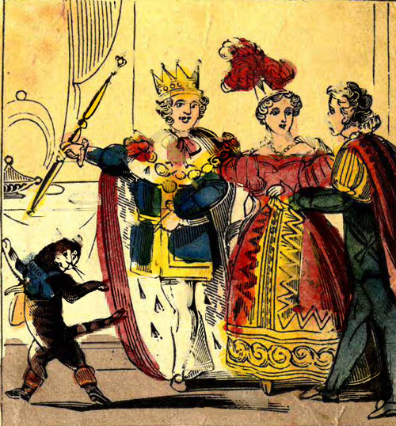

The king and princess now arriv\'d at the place,\
 But Puss who had travell\'d much faster,\
 Came out and invited them in with much grace,\
 In the name of the Marquis, his master.\

In a spacious saloon, they sat themselves down,\
 Where a banquet was already spread,\
 And that day, \"PUSS IN BOOTS\" gain\'d greater renown,\
 For the marquis and princess were wed.\

------------------------------------------------------------------------

## PUBLISHED

## UNIFORMLY WITH THIS

#### *The following Sorts.*

- The House that Jack Built
- The Ladder to Learning
- The Comic Drama of Punch and Judy
- The Adventures of Puss in Boots
- The Peahen at Home, or the Swan\'s Bridal Day
- The Butterfly\'s Ball and the Grasshopper\'s Feast
- The Adventures of Little Dame Crump, and her White Pig
- The history of the Children in the Wood
- The Life and Death of Cock Robin
- Adventures of Paul Pry and his young Friend in London
- Cinderella, or the Little Glass Slipper
- Adventures of Goody Two Shoes
- Comical Adventures of the Old Woman and Pedlar
- The History of an Apple Pie
- Adventures of Timothy Dump and his Dog Toby
- Nursery Rhymes, illustrated
- The Cradle Hymn, by Dr. Watts
- Adventures of Little Red Riding Hood
- The New London Cries, or a Visit to Town
- Adventures of Mother Hubbard and her Dog
- History of Johnny Gilpin
- Adventures of Johnny Newcome in the Navy
- History of Whittington and his Cat
- Dame Trot her Comical Cat
- Visit to the Zoological Gardens, pt. 1
- Ditto                   ditto                pt. 2
- The Marriage of Cock Robin, and Jenny Wren

------------------------------------------------------------------------

#### Transcriber\'s Note

- Obvious punctuation and spelling errors repaired.

\*\*\* END OF THE PROJECT GUTENBERG EBOOK THE ADVENTURES OF PUSS IN BOOTS \*\*\*

Updated editions will replace the previous one---the old editions will be renamed.

Creating the works from print editions not protected by U.S. copyright law means that no one owns a United States copyright in these works, so the Foundation (and you!) can copy and distribute it in the United States without permission and without paying copyright royalties. Special rules, set forth in the General Terms of Use part of this license, apply to copying and distributing Project Gutenberg™ electronic works to protect the PROJECT GUTENBERG™ concept and trademark. Project Gutenberg is a registered trademark, and may not be used if you charge for an eBook, except by following the terms of the trademark license, including paying royalties for use of the Project Gutenberg trademark. If you do not charge anything for copies of this eBook, complying with the trademark license is very easy. You may use this eBook for nearly any purpose such as creation of derivative works, reports, performances and research. Project Gutenberg eBooks may be modified and printed and given away---you may do practically ANYTHING in the United States with eBooks not protected by U.S. copyright law. Redistribution is subject to the trademark license, especially commercial redistribution.

START: FULL LICENSE

## THE FULL PROJECT GUTENBERG™ LICENSE

PLEASE READ THIS BEFORE YOU DISTRIBUTE OR USE THIS WORK

To protect the Project Gutenberg™ mission of promoting the free distribution of electronic works, by using or distributing this work (or any other work associated in any way with the phrase "Project Gutenberg"), you agree to comply with all the terms of the Full Project Gutenberg License available with this file or online at www.gutenberg.org/license.

Section 1. General Terms of Use and Redistributing Project Gutenberg electronic works

1.A. By reading or using any part of this Project Gutenberg electronic work, you indicate that you have read, understand, agree to and accept all the terms of this license and intellectual property (trademark/copyright) agreement. If you do not agree to abide by all the terms of this agreement, you must cease using and return or destroy all copies of Project Gutenberg electronic works in your possession. If you paid a fee for obtaining a copy of or access to a Project Gutenberg electronic work and you do not agree to be bound by the terms of this agreement, you may obtain a refund from the person or entity to whom you paid the fee as set forth in paragraph 1.E.8.

1.B. "Project Gutenberg" is a registered trademark. It may only be used on or associated in any way with an electronic work by people who agree to be bound by the terms of this agreement. There are a few things that you can do with most Project Gutenberg electronic works even without complying with the full terms of this agreement. See paragraph 1.C below. There are a lot of things you can do with Project Gutenberg electronic works if you follow the terms of this agreement and help preserve free future access to Project Gutenberg electronic works. See paragraph 1.E below.

1.C. The Project Gutenberg Literary Archive Foundation ("the Foundation" or PGLAF), owns a compilation copyright in the collection of Project Gutenberg electronic works. Nearly all the individual works in the collection are in the public domain in the United States. If an individual work is unprotected by copyright law in the United States and you are located in the United States, we do not claim a right to prevent you from copying, distributing, performing, displaying or creating derivative works based on the work as long as all references to Project Gutenberg are removed. Of course, we hope that you will support the Project Gutenberg mission of promoting free access to electronic works by freely sharing Project Gutenberg works in compliance with the terms of this agreement for keeping the Project Gutenberg name associated with the work. You can easily comply with the terms of this agreement by keeping this work in the same format with its attached full Project Gutenberg License when you share it without charge with others.

1.D. The copyright laws of the place where you are located also govern what you can do with this work. Copyright laws in most countries are in a constant state of change. If you are outside the United States, check the laws of your country in addition to the terms of this agreement before downloading, copying, displaying, performing, distributing or creating derivative works based on this work or any other Project Gutenberg work. The Foundation makes no representations concerning the copyright status of any work in any country other than the United States.

1.E. Unless you have removed all references to Project Gutenberg:

1.E.1. The following sentence, with active links to, or other immediate access to, the full Project Gutenberg License must appear prominently whenever any copy of a Project Gutenberg work (any work on which the phrase "Project Gutenberg" appears, or with which the phrase "Project Gutenberg" is associated) is accessed, displayed, performed, viewed, copied or distributed:

> ::: {}
> This eBook is for the use of anyone anywhere in the United States and most other parts of the world at no cost and with almost no restrictions whatsoever. You may copy it, give it away or re-use it under the terms of the Project Gutenberg™ License included with this eBook or online at [www.gutenberg.org](https://www.gutenberg.org). If you are not located in the United States, you will have to check the laws of the country where you are located before using this eBook.
> :::

1.E.2. If an individual Project Gutenberg electronic work is derived from texts not protected by U.S. copyright law (does not contain a notice indicating that it is posted with permission of the copyright holder), the work can be copied and distributed to anyone in the United States without paying any fees or charges. If you are redistributing or providing access to a work with the phrase "Project Gutenberg" associated with or appearing on the work, you must comply either with the requirements of paragraphs 1.E.1 through 1.E.7 or obtain permission for the use of the work and the Project Gutenberg trademark as set forth in paragraphs 1.E.8 or 1.E.9.

1.E.3. If an individual Project Gutenberg electronic work is posted with the permission of the copyright holder, your use and distribution must comply with both paragraphs 1.E.1 through 1.E.7 and any additional terms imposed by the copyright holder. Additional terms will be linked to the Project Gutenberg License for all works posted with the permission of the copyright holder found at the beginning of this work.

1.E.4. Do not unlink or detach or remove the full Project Gutenberg License terms from this work, or any files containing a part of this work or any other work associated with Project Gutenberg.

1.E.5. Do not copy, display, perform, distribute or redistribute this electronic work, or any part of this electronic work, without prominently displaying the sentence set forth in paragraph 1.E.1 with active links or immediate access to the full terms of the Project Gutenberg License.

1.E.6. You may convert to and distribute this work in any binary, compressed, marked up, nonproprietary or proprietary form, including any word processing or hypertext form. However, if you provide access to or distribute copies of a Project Gutenberg work in a format other than "Plain Vanilla ASCII" or other format used in the official version posted on the official Project Gutenberg website (www.gutenberg.org), you must, at no additional cost, fee or expense to the user, provide a copy, a means of exporting a copy, or a means of obtaining a copy upon request, of the work in its original "Plain Vanilla ASCII" or other form. Any alternate format must include the full Project Gutenberg License as specified in paragraph 1.E.1.

1.E.7. Do not charge a fee for access to, viewing, displaying, performing, copying or distributing any Project Gutenberg works unless you comply with paragraph 1.E.8 or 1.E.9.

1.E.8. You may charge a reasonable fee for copies of or providing access to or distributing Project Gutenberg electronic works provided that:

- • You pay a royalty fee of 20% of the gross profits you derive from the use of Project Gutenberg works calculated using the method you already use to calculate your applicable taxes. The fee is owed to the owner of the Project Gutenberg trademark, but he has agreed to donate royalties under this paragraph to the Project Gutenberg Literary Archive Foundation. Royalty payments must be paid within 60 days following each date on which you prepare (or are legally required to prepare) your periodic tax returns. Royalty payments should be clearly marked as such and sent to the Project Gutenberg Literary Archive Foundation at the address specified in Section 4, "Information about donations to the Project Gutenberg Literary Archive Foundation."
- • You provide a full refund of any money paid by a user who notifies you in writing (or by e-mail) within 30 days of receipt that s/he does not agree to the terms of the full Project Gutenberg™ License. You must require such a user to return or destroy all copies of the works possessed in a physical medium and discontinue all use of and all access to other copies of Project Gutenberg™ works.
- • You provide, in accordance with paragraph 1.F.3, a full refund of any money paid for a work or a replacement copy, if a defect in the electronic work is discovered and reported to you within 90 days of receipt of the work.
- • You comply with all other terms of this agreement for free distribution of Project Gutenberg™ works.

1.E.9. If you wish to charge a fee or distribute a Project Gutenberg™ electronic work or group of works on different terms than are set forth in this agreement, you must obtain permission in writing from the Project Gutenberg Literary Archive Foundation, the manager of the Project Gutenberg™ trademark. Contact the Foundation as set forth in Section 3 below.

1.F.

1.F.1. Project Gutenberg volunteers and employees expend considerable effort to identify, do copyright research on, transcribe and proofread works not protected by U.S. copyright law in creating the Project Gutenberg™ collection. Despite these efforts, Project Gutenberg™ electronic works, and the medium on which they may be stored, may contain "Defects," such as, but not limited to, incomplete, inaccurate or corrupt data, transcription errors, a copyright or other intellectual property infringement, a defective or damaged disk or other medium, a computer virus, or computer codes that damage or cannot be read by your equipment.

1.F.2. LIMITED WARRANTY, DISCLAIMER OF DAMAGES - Except for the "Right of Replacement or Refund" described in paragraph 1.F.3, the Project Gutenberg Literary Archive Foundation, the owner of the Project Gutenberg™ trademark, and any other party distributing a Project Gutenberg™ electronic work under this agreement, disclaim all liability to you for damages, costs and expenses, including legal fees. YOU AGREE THAT YOU HAVE NO REMEDIES FOR NEGLIGENCE, STRICT LIABILITY, BREACH OF WARRANTY OR BREACH OF CONTRACT EXCEPT THOSE PROVIDED IN PARAGRAPH 1.F.3. YOU AGREE THAT THE FOUNDATION, THE TRADEMARK OWNER, AND ANY DISTRIBUTOR UNDER THIS AGREEMENT WILL NOT BE LIABLE TO YOU FOR ACTUAL, DIRECT, INDIRECT, CONSEQUENTIAL, PUNITIVE OR INCIDENTAL DAMAGES EVEN IF YOU GIVE NOTICE OF THE POSSIBILITY OF SUCH DAMAGE.

1.F.3. LIMITED RIGHT OF REPLACEMENT OR REFUND - If you discover a defect in this electronic work within 90 days of receiving it, you can receive a refund of the money (if any) you paid for it by sending a written explanation to the person you received the work from. If you received the work on a physical medium, you must return the medium with your written explanation. The person or entity that provided you with the defective work may elect to provide a replacement copy in lieu of a refund. If you received the work electronically, the person or entity providing it to you may choose to give you a second opportunity to receive the work electronically in lieu of a refund. If the second copy is also defective, you may demand a refund in writing without further opportunities to fix the problem.

1.F.4. Except for the limited right of replacement or refund set forth in paragraph 1.F.3, this work is provided to you 'AS-IS', WITH NO OTHER WARRANTIES OF ANY KIND, EXPRESS OR IMPLIED, INCLUDING BUT NOT LIMITED TO WARRANTIES OF MERCHANTABILITY OR FITNESS FOR ANY PURPOSE.

1.F.5. Some states do not allow disclaimers of certain implied warranties or the exclusion or limitation of certain types of damages. If any disclaimer or limitation set forth in this agreement violates the law of the state applicable to this agreement, the agreement shall be interpreted to make the maximum disclaimer or limitation permitted by the applicable state law. The invalidity or unenforceability of any provision of this agreement shall not void the remaining provisions.

1.F.6. INDEMNITY - You agree to indemnify and hold the Foundation, the trademark owner, any agent or employee of the Foundation, anyone providing copies of Project Gutenberg™ electronic works in accordance with this agreement, and any volunteers associated with the production, promotion and distribution of Project Gutenberg™ electronic works, harmless from all liability, costs and expenses, including legal fees, that arise directly or indirectly from any of the following which you do or cause to occur: (a) distribution of this or any Project Gutenberg work, (b) alteration, modification, or additions or deletions to any Project Gutenberg work, and (c) any Defect you cause.

Section 2. Information about the Mission of Project Gutenberg

Project Gutenberg is synonymous with the free distribution of electronic works in formats readable by the widest variety of computers including obsolete, old, middle-aged and new computers. It exists because of the efforts of hundreds of volunteers and donations from people in all walks of life.

Volunteers and financial support to provide volunteers with the assistance they need are critical to reaching Project Gutenberg's goals and ensuring that the Project Gutenberg collection will remain freely available for generations to come. In 2001, the Project Gutenberg Literary Archive Foundation was created to provide a secure and permanent future for Project Gutenberg and future generations. To learn more about the Project Gutenberg Literary Archive Foundation and how your efforts and donations can help, see Sections 3 and 4 and the Foundation information page at www.gutenberg.org.

Section 3. Information about the Project Gutenberg Literary Archive Foundation

The Project Gutenberg Literary Archive Foundation is a non-profit 501(c)(3) educational corporation organized under the laws of the state of Mississippi and granted tax exempt status by the Internal Revenue Service. The Foundation's EIN or federal tax identification number is 64-6221541. Contributions to the Project Gutenberg Literary Archive Foundation are tax deductible to the full extent permitted by U.S. federal laws and your state's laws.

The Foundation's business office is located at 41 Watchung Plaza #516, Montclair NJ 07042, USA, +1 (862) 621-9288. Email contact links and up to date contact information can be found at the Foundation's website and official page at www.gutenberg.org/contact

Section 4. Information about Donations to the Project Gutenberg Literary Archive Foundation

Project Gutenberg™ depends upon and cannot survive without widespread public support and donations to carry out its mission of increasing the number of public domain and licensed works that can be freely distributed in machine-readable form accessible by the widest array of equipment including outdated equipment. Many small donations (\$1 to \$5,000) are particularly important to maintaining tax exempt status with the IRS.

The Foundation is committed to complying with the laws regulating charities and charitable donations in all 50 states of the United States. Compliance requirements are not uniform and it takes a considerable effort, much paperwork and many fees to meet and keep up with these requirements. We do not solicit donations in locations where we have not received written confirmation of compliance. To SEND DONATIONS or determine the status of compliance for any particular state visit [www.gutenberg.org/donate](https://www.gutenberg.org/donate/).

While we cannot and do not solicit contributions from states where we have not met the solicitation requirements, we know of no prohibition against accepting unsolicited donations from donors in such states who approach us with offers to donate.

International donations are gratefully accepted, but we cannot make any statements concerning tax treatment of donations received from outside the United States. U.S. laws alone swamp our small staff.

Please check the Project Gutenberg web pages for current donation methods and addresses. Donations are accepted in a number of other ways including checks, online payments and credit card donations. To donate, please visit: www.gutenberg.org/donate.

Section 5. General Information About Project Gutenberg electronic works

Professor Michael S. Hart was the originator of the Project Gutenberg concept of a library of electronic works that could be freely shared with anyone. For forty years, he produced and distributed Project Gutenberg eBooks with only a loose network of volunteer support.

Project Gutenberg eBooks are often created from several printed editions, all of which are confirmed as not protected by copyright in the U.S. unless a copyright notice is included. Thus, we do not necessarily keep eBooks in compliance with any particular paper edition.

Most people start at our website which has the main PG search facility: [www.gutenberg.org](https://www.gutenberg.org).

This website includes information about Project Gutenberg, including how to make donations to the Project Gutenberg Literary Archive Foundation, how to help produce our new eBooks, and how to subscribe to our email newsletter to hear about new eBooks.
